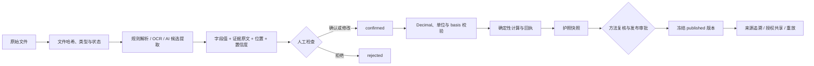
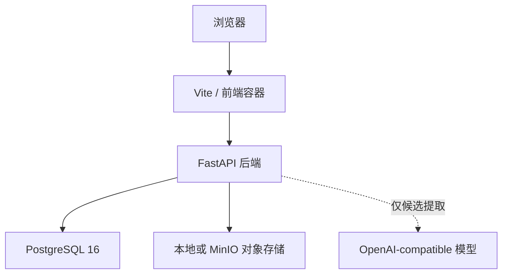

# CarbonLab OPC 系统架构

## 1. 架构结论

系统不是让大模型直接“算碳”，而是把大模型放在最适合的位置：从非结构化文件中提出候选。正式数据必须经过证据校验和人类确认；正式结果只由可重放的确定性代码产生。

## 2. 数据流



## 3. 模块边界

| 模块 | 主要职责 | 不承担的职责 |
|---|---|---|
| 文件接入 | 上传、哈希、类型、存储引用、状态 | 判断正式数值正确性 |
| AI 候选提取 | 分类、候选字段、置信度、摘要 | 确认、计算、发布 |
| 证据校验 | 验证字段是否被对应引文支持 | 替代人工业务判断 |
| 人工确认 | 确认、修改、拒绝、理由和操作者留痕 | 改写原始文件 |
| 确定性计算 | Decimal、单位、basis、公式和回执 | 使用 LLM 猜数 |
| 账本与版本 | 来源链、不可变记录、冻结快照、重放 | 证明法定合规 |
| 工厂碳数据护照 | 汇总装置、产品、期间、证据与版本 | 取代第三方核查证书 |
| 授权共享 | 最小 scope、有效期、撤销、导出事件 | 默认公开企业数据 |

## 4. 状态机

目标状态：

```text
received
→ candidate
→ evidence_checked
→ confirmed 或 rejected
→ calculated
→ frozen
→ published
```

关键不变量：

1. `candidate` 不得直接写入正式账本；
2. `candidate` 不得直接进入 `calculated` 或 `published`；
3. 只有人类行为可以形成 `confirmed`；
4. 计算只接收已确认、精确、单位合法的输入；
5. 发布必须绑定规则、证据、方法复核和重放结果；
6. 发布版本不可被静默修改，只能产生新版本；
7. 分享必须有 scope、有效期和撤销记录。

现有代码覆盖这些约束的主要路径；尚未由新仓库测试证明的细分状态将在功能矩阵中标记为“部分完成”，不伪造完成状态。

## 5. 后端结构

```text
backend/api/            auth、health、upload、ai、passports
backend/ai/             OCR、文档理解、Provider 封装
backend/services/       入账、CBAM 归集、SEE、护照和规则服务
backend/core/           精确单位和内容哈希
backend/models/         迁移闭环需要的数据模型
backend/alembic/        001—032 数据库迁移链
backend/validation/     合同、提示、Provider、评分、报告与合成数据
```

API 暴露面已从旧平台的 30 余个业务路由缩小为五类路由。历史迁移链仍包含部分旧表，因为护照 schema 建立在既有租户、企业、文档和账本表之上；这些旧表不等于旧业务功能仍对外开放。

## 6. 前端结构

```text
/login       登录与会话恢复
/upload      文件接入、识别结果、候选确认和正式入账入口
/passports   护照账户、完整度、版本、来源、重放和共享
```

旧平台的碳市场、金融、供应商、ERP、AgentOps 等页面未进入新路由。

## 7. 数据和证据

- 原始文件以内容哈希和存储引用标识；
- 候选输出保留原始字符串，不先转成 float；
- 字段证据必须与该字段对应，不能只验证“引文在某份文档出现过”；
- 正式活动数据记录来源文件、确认人、时间和确认内容；
- 计算结果绑定活动、排放因子、公式、规则版本和审计轨迹；
- 护照快照包含 `derived_from`，发布时数据库重新计算关键哈希；
- 重放不匹配时不得把版本当作可靠发布结果。

## 8. AI Provider 可替换设计

模型遵循 `validation/llm/LLM_OPERATING_CONTRACT.md` 和固定 JSON Schema。替换模型时，不以“能返回 JSON”作为准入标准，而是比较：

- 字段准确性；
- 缺失值是否诚实留空；
- 字段与证据是否匹配；
- Prompt Injection 是否被拒绝；
- 重复运行是否稳定；
- 是否泄露请求配置中的凭据 canary。

当前没有有效准入锁，因此 Provider 可配置不等于模型已获准进入真实业务。

## 9. 部署结构



迁移后的 Docker Compose 默认用于本地开发和赛事复现，不是生产高可用部署方案。

## 10. 信任边界

- 模型输出：不可信候选；
- 人工确认：业务批准，但仍要通过单位和规则校验；
- 确定性计算：可重放结果；
- 发布快照：冻结的系统记录；
- 第三方/监管认可：系统外部结论，本项目不得自行宣称。
